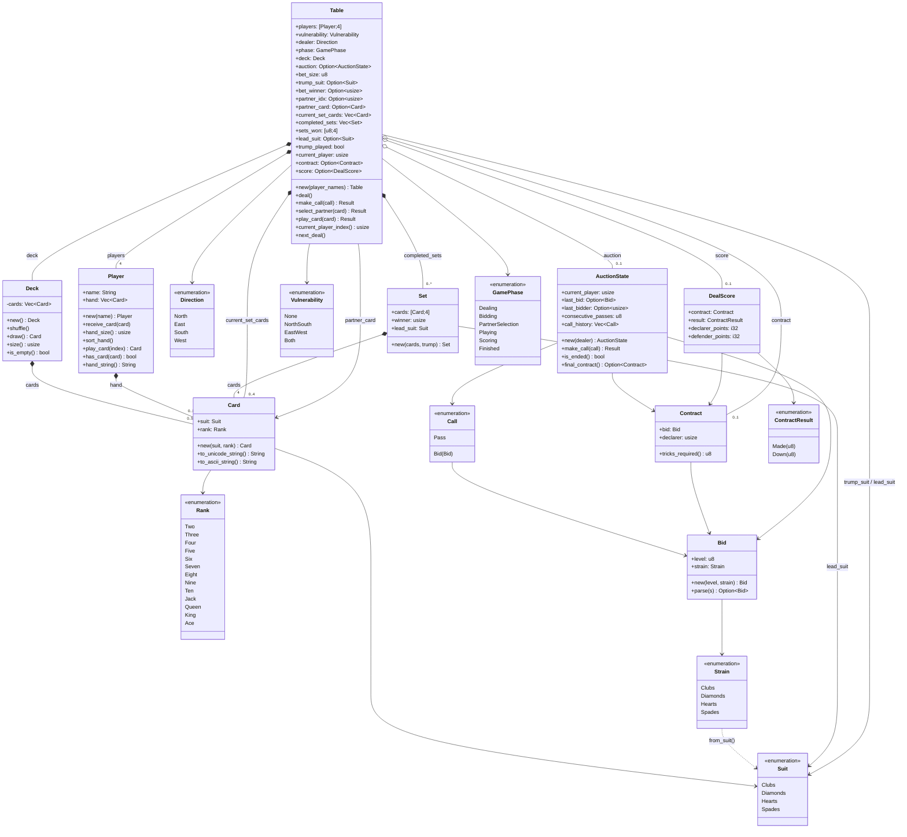

# Game Core UML Class Diagram

This diagram is derived from the Rust domain model in `backend/crates/game-core/src`.
It focuses on the core entities, enums, and their relationships in the bridge game engine.

